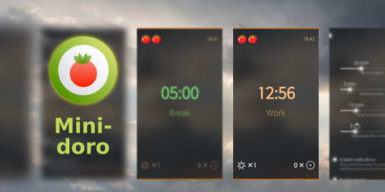

<!--
SPDX-FileCopyrightText: 2018-2026 Mirian Margiani
SPDX-License-Identifier: GFDL-1.3-or-later
-->

# Minidoro for Sailfish OS

Minidoro is a minimalist Pomodoro® Technique timer helping to get things done.

This app is modelled after [Minidoro for Android](https://github.com/ympavlov/minidoro)
by Yury Pavlov. You can get it [from F-Droid](https://f-droid.org/en/packages/com.github.ympavlov.minidoro/)
if you are using Android.

**Note:** Minidoro requires the “Audio” permission for playing sounds when
intervals are started and finished.

## How it works

The Pomodoro® Technique is an extremely simple but efficient time management
technique developed by Francesco Cirillo.

The basic idea is it's simpler to concentrate on work for a relatively short
period, keeping in mind you can take a rest or switch to another activity
afterwards.

- Split your work for 25 minute intervals, separated by short break periods.
- In these 25 minute intervals try to focus on your work as much as possible,
  try to not distract yourself and to avoid other distractions.
- After a 25 minute interval take a 5 minute break. During this break do any
  other activities except for the previous work.
- Return to the work after the break.
- Take a long break of about 10–30 minutes after every 4 work intervals.

See the [website](https://francescocirillo.com/pages/pomodoro-technique) for an
in-depth explanation.

### Counters

There are two counters at the bottom of the main page. They can be used to count
anything. For example, you can count external interruptions with the left
counter, while counting internal interruptions (you interrupting yourself) with
the right counter. See also
[this issue](https://github.com/ympavlov/minidoro/issues/4#issuecomment-1032949886).

## Help and support

You are welcome to [leave a comment in the forum](https://forum.sailfishos.org/t/apps-by-ichthyosaurus/15753)
if you have any questions or ideas.

## Translations

It would be wonderful if the app could be translated in as many languages as possible!

Translations are managed using
[Weblate](https://hosted.weblate.org/projects/harbour-minidoro/translations).
Please prefer this over pull request (which are still welcome, of course).
If you just found a minor problem, you can also
[leave a comment in the forum](https://forum.sailfishos.org/t/apps-by-ichthyosaurus/15753)
or [open an issue](https://github.com/ichthyosaurus/harbour-minidoro/issues/new).

Please include the following details:

1. the language you were using
2. where you found the error
3. the incorrect text
4. the correct translation

### Manually updating translations

Please prefer using
[Weblate](https://hosted.weblate.org/projects/harbour-minidoro) over this.
You can follow these steps to manually add or update a translation:

1. *If it did not exist before*, create a new catalog for your language by copying the
   base file [translations/harbour-minidoro.ts](translations/harbour-minidoro.ts).
   Then add the new translation to [harbour-minidoro.pro](harbour-minidoro.pro).
2. Add yourself to the list of translators in [TRANSLATORS.json](TRANSLATORS.json),
   in the section `extra`.
3. (optional) Translate the app's name in [harbour-minidoro.desktop](harbour-minidoro.desktop)
   if there is a (short) native term for it in your language.

See [the Qt documentation](https://doc.qt.io/qt-5/qml-qtqml-date.html#details) for
details on how to translate date formats to your *local* format.

## Building and contributing

*Bug reports, and contributions for translations, bug fixes, or new features are always welcome!*

1. Clone the repository by running `git clone https://github.com/ichthyosaurus/harbour-minidoro.git`
2. Open `harbour-minidoro.pro` in Sailfish OS IDE (Qt Creator for Sailfish)
3. To run on emulator, select the `i486` target and press the run button
4. To build for the device, select the `aarch64` or `armv7hl` target and click “deploy all”;
   the RPM packages will be in the `RPMS` folder

If you contribute, please do not forget to add yourself to the list of
contributors in [qml/pages/AboutPage.qml](qml/pages/AboutPage.qml)!

## Donations

If you want to support my work, I am always happy if you buy me a cup of coffee
through [Liberapay](https://liberapay.com/ichthyosaurus).

Of course it would be much appreciated as well if you support this project by
contributing to translations or code! See above how you can contribute 🎕.

## Anti-AI policy <a id='ai-policy'/>

AI-generated contributions are forbidden.

Please be transparent, respect the Free Software community, and adhere to the
licenses. This is a welcoming place for human creativity and diversity, but
AI-generated slop is going against these values.

Apart from all the ethical, moral, legal, environmental, social, and technical
reasons against AI, I also simply don't have any spare time to review
AI-generated contributions.

## License

> Copyright (C) 2022-2026  Mirian Margiani

Minidoro is Free Software released under the terms of the
[GNU General Public License v3 (or later)](https://spdx.org/licenses/GPL-3.0-or-later.html).
The source code is available [on Github](https://github.com/ichthyosaurus/harbour-minidoro).
All documentation is released under the terms of the
[GNU Free Documentation License v1.3 (or later)](https://spdx.org/licenses/GFDL-1.3-or-later.html).

This project follows the [REUSE specification](https://api.reuse.software/info/github.com/ichthyosaurus/harbour-minidoro).
